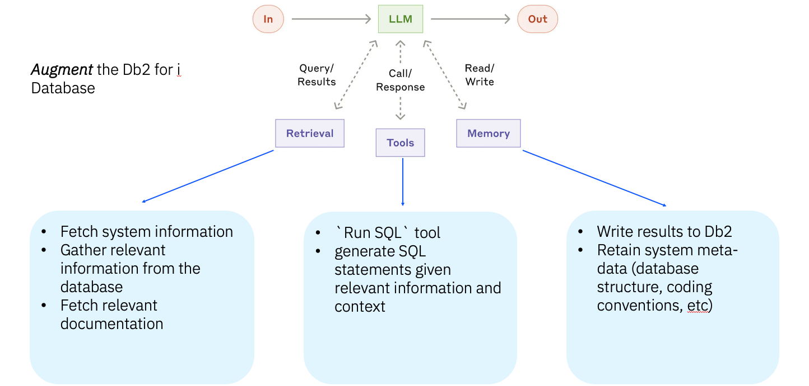

<details>
   <summary>Table of Contents</summary>
   
- [🤖 Db2 for i AI Agents Cookbook](#-db2-for-i-ai-agents-cookbook)
  - [💡 Agentic Patterns for Db2 for i](#-agentic-patterns-for-db2-for-i)
    - [🧠 What is Agentic AI?](#-what-is-agentic-ai)
  - [📂 Repository Structure](#-repository-structure)
  - [📋 Requirements](#-requirements)
  - [🚀 Getting Started](#-getting-started)
    - [Step 1: 🛠️ Start Mapepire on IBM i](#step-1-️-start-mapepire-on-ibm-i)
    - [Step 2: 📝 Setup Environment](#step-2--setup-environment)
    - [Step 3: 📦 Install uv Package Manager](#step-3--install-uv-package-manager)
    - [Step 4: 🤖 Choose Your AI Model Provider](#step-4--choose-your-ai-model-provider)
      - [🏠 Local Models (Recommended for Getting Started)](#-local-models-recommended-for-getting-started)
      - [📊 Model Recommendations](#-model-recommendations)
      - [☁️ Cloud Providers (Optional)](#️-cloud-providers-optional)
  - [🔥 Quickstart - Run Your First Agent](#-quickstart---run-your-first-agent)
    - [🚀 Next Steps: Explore More Examples](#-next-steps-explore-more-examples)
  - [🧩 Explore Agent Frameworks](#-explore-agent-frameworks)
    - [Getting Started with Frameworks](#getting-started-with-frameworks)
  - [🧠 Agent Concepts](#-agent-concepts)
  - [📊 Agent Framework Comparison](#-agent-framework-comparison)
  - [🌟 Highlighted Demos](#-highlighted-demos)
    - [LangChain 🔍](#langchain-)
    - [MCP Server in Continue: 🚀](#mcp-server-in-continue-)
  - [📚 SAMPLE Database](#-sample-database)
</details>


# 🤖 Db2 for i AI Agents Cookbook

This repository helps you explore and implement AI agents that work with Db2 for i and IBM i systems. Whether you're new to AI or an experienced developer, you'll find examples, frameworks, and educational resources to help you build powerful AI solutions. ✨

## 💡 Agentic Patterns for Db2 for i



### 🧠 What is Agentic AI?

AI agents are software programs that can:

- 🔍 Understand what you're asking them to do
- ✏️ Plan a series of steps to accomplish tasks
- 🔧 Use tools to interact with databases and systems
- 📈 Learn from their actions and your feedback

Unlike basic AI chat interfaces, agents can maintain context across conversations, work with your data, and execute multi-step operations. For Db2 and IBM i users, this means AI can help with:

- 💻 Writing and troubleshooting SQL queries
- 🔎 Finding and analyzing information in your databases
- ⚙️ Automating repetitive database tasks
- 📊 Building reports and visualizations
- 🙌 Helping less technical users access database information

Agents work by combining large language models with specialized tools that connect to your systems. Think of them as AI assistants that can actually take actions on your behalf! 🤝


*IBM i Performance Metrics Assistant analyzing top CPU-consuming jobs*
 > [!TIP]
 > Run this demo yourself by following the instructions in the [examples directory](examples/)!
 > - Run the examples CLI by following the [CLI documentation](examples/agents-infra/CLI_README.md)


## 📂 Repository Structure

This repository is organized into three main sections:

- **🏗️ [`frameworks/`](frameworks/)**: Ready-to-use agent implementations 
  - [`frameworks/agents/`](frameworks/agents/): Different AI frameworks (LangChain, Agno, CrewAI, etc.)
  - [`frameworks/mcp/`](frameworks/mcp/): Model Context Protocol for advanced AI-database communication

- **🎓 [`concepts/`](concepts/)**: Educational resources to learn about agent capabilities 
  - [`concepts/knowledge/`](concepts/knowledge/): How agents store and access information
  - [`concepts/memory/`](concepts/memory/): How agents remember past interactions
  - [`concepts/reasoning/`](concepts/reasoning/): How agents think through problems
  - [`concepts/tools/`](concepts/tools/): What agents can do with your systems
  - [`concepts/agents/`](concepts/agents/): Examples of agent implementations
  - [`concepts/observability/`](concepts/observability/): Monitoring and logging agent actions

- **☕ [`examples/`](examples/)**: Simple demonstrations and complete applications

- **📄 [`docs/`](docs/)**: Additional documentation and guides

## 📋 Requirements

- For Python examples: Python 3.9+ and the `uv` package manager
- For TypeScript examples: Node.js 18+ and npm/yarn
- Access to a Db2 for i instance
- Mapepire database access layer

## 🚀 Getting Started

Get up and running with Db2 for i AI agents in 4 simple steps:

### Step 1: 🛠️ Start Mapepire on IBM i

[Mapepire](https://mapepire-ibmi.github.io/) is a modern database connector that makes it easy for AI agents to work with your Db2 data. 🌉

On your IBM i system, install and start Mapepire:
```bash
yum install service-commander
yum install mapepire-server 
sc start mapepire-server 
```

That's it! Mapepire runs on port 8076 by default and provides secure, AI-friendly database access.

### Step 2: 📝 Setup Environment

1. Clone this repository:
   ```bash
   git clone https://github.com/ajshedivy/db2i-agents.git
   cd db2i-agents
   ```

2. Create your `.env` file from the provided template:
   ```bash
   # Copy the template file
   cp env.sample .env
   ```

3. Edit the `.env` file with your actual credentials:
   ```bash
   vim .env  # or use your preferred editor
   ```
   
   Update the following values in `.env`:
   ```bash
   HOST=your_actual_host_name
   DB_USER=your_actual_username  
   PASSWORD=your_actual_password
   # Uncomment and add API keys for cloud providers if needed
   ```

### Step 3: 📦 Install uv Package Manager

Install `uv` - a fast Python package manager that handles all dependencies:
```bash
curl -LsSf https://astral.sh/uv/install.sh | sh
```

### Step 4: 🤖 Choose Your AI Model Provider

#### 🏠 Local Models (Recommended for Getting Started)

**Ollama** - Run AI models locally, no API keys needed!

1. Install Ollama from [ollama.com](https://ollama.com/)
2. Pull recommended models:
   ```bash
   ollama pull llama3.1        # for general tasks
   ollama pull qwen2.5:latest  # Excellent for coding
   ollama pull gpt-oss:20b     # NEW - GPT-like experience locally
   ```

#### 📊 Model Recommendations

| Model | Best For | Size | Performance |
|-------|----------|------|-------------|
| `llama3.1` | General AI tasks, conversations | 4.9GB | Balanced speed/quality |
| `qwen2.5:latest` | Code generation, SQL queries | 4.7GB | Fast, code-focused |
| `gpt-oss:20b` | GPT-like experience locally | 14GB | **NEW** - Great general model |
| `llama3.1:70b` | Complex reasoning, production | 40GB | Highest quality |
| `qwen3-coder:latest` | Code generation, SQL queries | 19GB | Fast, code-focused |

> 💡 **New Model**: [`gpt-oss`](https://ollama.com/library/gpt-oss) provides a GPT-like experience running locally - great for users familiar with OpenAI's models!

#### ☁️ Cloud Providers (Optional)

For production use or specific model requirements:

| Provider | Best For | Setup |
|----------|----------|--------|
| **OpenAI** | GPT-4, production reliability | Add `OPENAI_API_KEY` to .env |
| **Anthropic** | Claude models, long conversations | Add `ANTHROPIC_API_KEY` to .env |  
| **IBM watsonx** | Enterprise compliance | Add `IBM_WATSONX_*` keys to .env |

> 💡 **Tip**: Start with Ollama for learning, then upgrade to cloud providers for production workloads.

## 🔥 Quickstart - Run Your First Agent

Ready to see AI agents in action? Run this simple example:

```bash
# Navigate to examples directory
cd examples/agents/sample/

# Run an agent that queries your database
uv run get_employee_info_workflow.py --chain --question "how many employees are there?"
```

🎉 That's it! The agent will connect to your database, understand your question, write SQL, and provide an answer.

### 🚀 Next Steps: Explore More Examples

Head to the [`examples/`](examples/) directory to discover:
- **Simple agents**: Basic database queries and analysis
- **Advanced workflows**: Multi-step reasoning and complex tasks  
- **Complete applications**: Ready-to-use AI-powered tools

Each example includes detailed documentation and can be run with a single `uv run` command!

## 🧩 Explore Agent Frameworks

This repository includes several powerful frameworks for building AI agents, each with unique strengths:

### Getting Started with Frameworks

| Framework | Best For | Key Feature |
|:----------|:---------|:------------|
| [🔗 LangChain](frameworks/agents/langchain/README.md) | Production-ready solutions | Robust ecosystem with extensive integrations |
| [🏗️ Agno](frameworks/agents/agno/README.md) | Agent performance and flexibility | Transparent architecture that reveals core agent concepts |
| [📡 MCP](frameworks/mcp/README.md) | Standardized context | Consistent way to provide context to LLMs |

To explore these frameworks:
1. Navigate to the framework directory (e.g., `cd frameworks/agents/langchain`)
2. Follow the framework-specific README instructions
3. Run the included demos to see agents in action

> 💡 **Recommendation**: Choose LangChain when you need comprehensive, battle-tested solutions. Use Agno when you want to deeply understand agent architecture or need a lightweight framework that makes the concepts behind agent construction more transparent.

## 🧠 Agent Concepts

Understanding how agents work is key to building effective solutions. Our [`concepts/`](concepts/README.md) directory breaks down the essential components:

- **📚 Knowledge**: How agents store, retrieve, and use information
  - Vector databases, embeddings, retrieval techniques
  
- **🔄 Memory**: How agents maintain conversation history and context
  - Short-term and long-term memory approaches

- **🤔 Reasoning**: How agents make decisions and solve problems
  - Chain-of-thought, tree-of-thought, and other reasoning patterns

- **🔧 Tools**: How agents interact with systems and data
  - Function calling, API integration, database connections

- **💾 Storage**: How agents persist and access data
  - Databases, file systems, caching strategies

Each concept includes code examples and explanations to help you implement these capabilities in your own agents.

## 📊 Agent Framework Comparison

| Framework | Languages | Implementation Status | Db2i Access Method | Supports MCP | Description |
|:----------|:----------|:----------------------|:------------------|:-------------|:--------------|
| [🔗 LangChain](frameworks/agents/langchain/) | Python ✅ | Complete ✅ | Mapepire 🔌 | Yes ✅ | Popular framework for developing applications powered by LLMs  |
| [🏗️ MCP](frameworks/mcp/) | Python ✅<br>TypeScript ✅ | Complete ✅ | Mapepire 🔌 | Yes ✅ | An open protocol that standardizes how applications provide context to LLMs. |
| [🧩 Agno](frameworks/agents/agno/) | Python ✅ | Complete ✅  | Mapepire 🔌 | Yes ✅ | An open source framework for building Agents with memory, knowledge, tools and reasoning. |
| [🐝 BeeAI](frameworks/agents/beeai/) | Python ✅<br>TypeScript ✅ | Coming soon ⏳| Mapepire 🔌 | Yes ✅ | An open-source ecosystem that empowers developers to discover, run, and compose AI agents from any framework. |
| [👥 CrewAI](frameworks/agents/crewai/) | Python ✅ | Coming soon ⏳ | Mapepire 🔌 | No ❌ | Fast and flexible Python Multi-Agent automation framework |

## 🌟 Highlighted Demos

### LangChain 🔍
https://github.com/user-attachments/assets/54c7335e-da98-4c92-ba8d-66836c39f79d

### MCP Server in Continue: 🚀
https://github.com/user-attachments/assets/f72f2982-0b0c-4da0-b488-59ae7f311fde


## 📚 SAMPLE Database

Most examples use the IBM-provided SAMPLE database. To create it on your system, run:

```sql
CALL QSYS.CREATE_SQL_SAMPLE('SAMPLE')
```

This creates tables with employee, department, and project data that the examples will work with! 🏢👩‍💼👨‍💼
