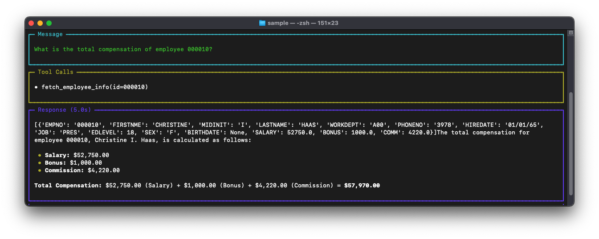
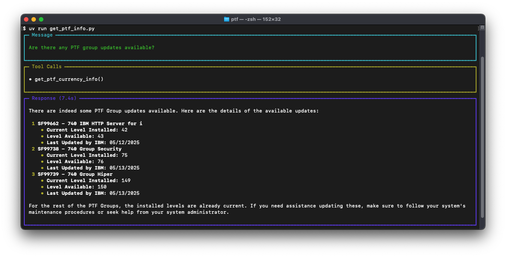

# 💡 Db2 for i AI Examples

This directory contains practical, ready-to-run examples that demonstrate how to use AI with Db2 for i databases. From simple scripts to complete applications, these examples provide clear starting points for your own AI projects.

## 🚨 Before You Start

**Have you completed the main setup?** These examples require the environment setup from the main README.

✅ **Required**: Complete the [Getting Started guide](../README.md#-getting-started) first, which covers:
- Setting up Mapepire on IBM i
- Creating your `.env` file with database credentials  
- Installing uv package manager
- Choosing your AI model provider

If you haven't done this yet, **stop here** and complete the main setup first.

## 🧪 Example Categories

This repository is organized into several main categories:

1. **`agents/`**: AI agent examples organized by category
   - **`sample/`**: Quick examples using the IBM SAMPLE database
   - **`performance/`**: Tools for monitoring and analyzing system performance
   - **`security/`**: Security assessment and remediation tools
   - **`services/`**: Examples that interact with IBM i Services (IFS, PTF, Java, SQL)
2. **`apps/`**: Complete applications with multiple components

## 📋 Current Examples

### Sample Database Examples
- 👥 [Employee Information Retrieval](agents/sample/get_employee_info_agent.py) - Simple agent that queries employee data from the SAMPLE database 
- 🔄 [Employee Info Workflow](agents/sample/get_employee_info_workflow.py) - LangChain workflow for employee data analysis
- 🔌 [Simple MCP Database Client](agents/sample/mcp_simple.py) - Basic MCP client for database queries

### Performance Monitoring Examples
- 📈 [Metrics Assistant CLI](agents/performance/metrics_assistant_cli.py) - Interactive CLI for monitoring system performance metrics
- 🔍 [SQL Examples RAG](agents/performance/sql_examples_rag.py) - Retrieval-augmented generation for SQL performance examples

### Security Examples
- 🛡️ [Security Assistant](agents/security/security_assistant.py) - Interactive CLI for analyzing security vulnerabilities
- 📝 [Security Agent Playground](agents/security/playground.py) - Testing environment for security analysis capabilities

### IBM i Services Examples
- 🔍 [Basic PTF Information Retrieval](agents/services/ptf/get_ptf_info.py) - Retrieve basic PTF information using AI
- 🔬 [Enhanced PTF Analysis](agents/services/ptf/get_ptf_info_extended.py) - Retrieve detailed PTF information with enhanced AI analysis
- 📂 [IFS File Reader](agents/services/ifs/read_stream_file.py) - Read and search file contents in the Integrated File System
- 💾 [IFS Storage Analyzer](agents/services/ifs/storage_assistant.py) - Find and analyze large files in the Integrated File System
- ☕ [JVM Performance Monitor](agents/services/java/jvm_assistant.py) - Monitor and optimize Java Virtual Machines on IBM i
- 🗃️ [SQL Services Agent](agents/services/sql_services_agent.py) - Interactive CLI for exploring IBM i SQL services
- 📓 [SQL Services Info Notebook](agents/services/sql_services_info.ipynb) - Jupyter notebook demonstrating SQL services queries

### Complete Applications
- 🧠 [SQL Agent with Knowledge Base](apps/sql_agent_with_knowledge/) - Interactive SQL assistant with built-in database knowledge

## 🚀 Running the Examples

Since you've completed the main setup, you can run examples directly:

### Quick Start

1. **Choose an example from the categories below**
2. **Navigate to its directory:**
   ```bash
   cd examples/agents/sample/  # or your chosen example directory
   ```
3. **Run the example:**
   ```bash
   uv run <script_name>.py
   ```

The examples will automatically find your root `.env` file with database credentials.

## 📚 Example Categories Explained

### Sample Examples

These work with the IBM SAMPLE database (created with `CALL QSYS.CREATE_SQL_SAMPLE('SAMPLE')`) and demonstrate basic AI agent capabilities in simple, single-file implementations.



### Performance Monitoring Examples

These examples demonstrate how to use AI agents to monitor and analyze system performance using SQL services. The interactive CLI provides real-time metrics and insights into system resources, memory usage, and job performance.

### Security Examples

These tools help analyze and remediate security vulnerabilities on IBM i systems. The security assistant identifies issues like exposed user profiles and provides automatic fix generation with proper authority settings.

### IBM i Services Examples

These showcase how AI agents can interact with IBM i Services (SQL interfaces to system information). Examples include PTF (Program Temporary Fix) information retrieval, Integrated File System (IFS) interaction, Java Virtual Machine (JVM) monitoring, and SQL services exploration.



### Complete Applications

Full applications that demonstrate more complex AI agent scenarios, including the SQL agent with knowledge base that can answer questions about database schemas.

## 📁 Directory Structure

```
examples/
├── agents/                     # AI agent examples organized by category
│   ├── sample/                 # Examples using the SAMPLE database
│   ├── performance/            # Performance monitoring examples
│   ├── security/               # Security assessment tools
│   └── services/               # Examples using IBM i services
│       ├── ifs/                # Integrated File System tools
│       ├── java/               # Java and JVM monitoring tools
│       └── ptf/                # PTF information services
└── apps/                       # Complete application examples
    └── sql_agent_with_knowledge/   # SQL agent with knowledge base
```

## 📚 Learning Path

If you're new to AI agents with Db2 for i, we recommend this learning path:

1. Start with 👥 [Employee Information Retrieval](agents/sample/get_employee_info_agent.py) to understand basic agent concepts
2. Try the 🔍 [Basic PTF Information Retrieval](agents/services/ptf/get_ptf_info.py) to see how agents can work with system information
3. Explore the 📂 [IFS File Reader](agents/services/ifs/read_stream_file.py) to learn how agents can work with the file system
4. Check out the 📈 [Metrics Assistant CLI](agents/performance/metrics_assistant_cli.py) to see how agents can monitor system performance
5. Try the 🛡️ [Security Assistant](agents/security/security_assistant.py) to learn about security assessment
6. Explore the 🧠 [SQL Agent with Knowledge Base](apps/sql_agent_with_knowledge/) to learn about more complex implementations