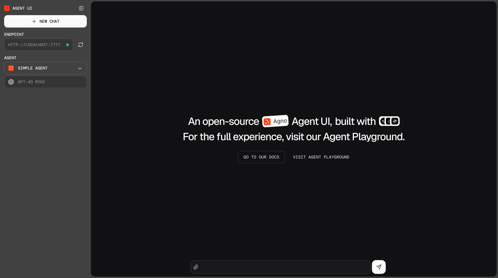

# Agno Db2i Agent

A collection of agents for interacting with Db2i databases using the Agno framework. This package includes a command-line interface and a web-based playground for database exploration and querying.

## Prerequisites

- Python 3.12+
- [uv](https://github.com/astral-sh/uv) for package management
- [Ollama](https://ollama.ai/) (optional, for local LLM support)
- [OpenAI API key](https://platform.openai.com/api-keys) (optional, for OpenAI model support)

## Run the Db2i Agent CLI

Install the dependencies:

- uv:  
    ```bash
    curl -LsSf https://astral.sh/uv/install.sh | sh
    ```

- Install Ollama from [Ollama](https://ollama.com/)
---

1. **Clone the repository:**
   ```bash
   git clone https://github.com/ajshedivy/db2i-agents.git
   cd db2i-agents/examples/agents/agno
   ```
2. **Prepare Ollama model:**
    ```bash
    ollama pull qwen2.5:latest
    ```
3. **Setup environment variables:**
    ```bash
    cp .env.example .env
    ```
    Fill out the `.env` file with your Mapepire credentials:

    ```env
    HOST=your_db2i_host
    DB_USER=your_username
    PORT=8076               # Default port for Mapepire
    PASSWORD=your_password
    SCHEMA=SAMPLE           # Or your preferred schema
    ```

4. **Run the CLI:**
    ```bash
    uv run agent.py
    ```


5. **Chat wth the agent**


### Demo
Once the agent is running, you can interact with it through the command line. You can ask questions about the database, and the agent will respond with relevant information.

here are some example queries you can try:
```text
What tables to I have access to?
which employee has the highest salary?
How many employees are in each department?
```

Here is quick demo of the agent in debug mode to show the tool calls and thinking process:


https://github.com/user-attachments/assets/4a865b3a-7f31-452f-9828-fc9536a2f0e9

## Run the Db2i Agent Web Playground

Agno provides a UI for interacting with your agents, completely open source. It’s a simple interface that allows you to chat with your agents, view their memory, knowledge, and more.

### Getting started

To run the Agent UI locally, cd to `agent-ui` and start the ui server:
```bash
cd db2i-agents/examples/agents/agno/agent-ui
npm run dev
```

Open http://localhost:3000 to view the Agent UI



### Connect Db2i Agent

The agent UI needs to connect to a playground server, which we can run locally. 

In another terminal, run the db2 playground server:

1. navigate to the `db2i-agents` directory:
   ```bash
   cd db2i-agents/examples/agents/agno
   ```
2. run the server:
   ```bash
   uv run db2i_playground.py
   ```
3. (Optional) Use OpenAI:
   ```bash
   export OPENAI_API_KEY=sk-***
   ```
   Run playground with `--use-openai` flag:
   ```bash
    uv run db2i_playground.py --use-openai
    ```

### View the playground

- Open http://localhost:3000 to view the Agent UI
- Select the localhost:7777 endpoint and start chatting with the db2i agent!
  


## Db2i Agent Workspace

Check out this repo to run a [Db2 for i agent application](https://github.com/ajshedivy/agent-app-agno) built with the Agno framework! 


## Mapepire AI Integration (WIP)

Mapepire AI is an AI platform for building tools to interact with your Db2 for i database. It provides an easy way to create SQL based tools that can seamlessly integrate with your LLM applications.

To test Mapepire AI tools, follow the instructions below:
1. Configure tools and generate MCP server token
2. Add MCP server token to `.env` file
    ```sh
    cd db2i-agents/examples/agents/agno
    cp .env.example .env
    ```
    fill out the `.env` file with your Mapepire credentials:
    ```ini
    MAPEPIRE_AI_MCP_URL="http://localhost:8080/sse?token=YOUR_TOKEN"

    HOST=X
    DB_USER=X
    PASSWORD=X
    PORT=8076
    SCHEMA=SAMPLE
    READONLY=True
    ```
3. pull Ollama model (if not already done):
    ```bash
    ollama pull qwen2.5:latest
    ```
4. Run the agent:
    ```bash
    uv run mapepire_ai.py --debug
    ```

### Demo


