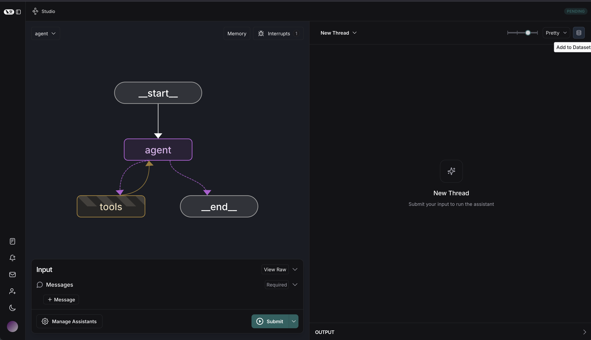

# 🔗 Langchain Db2i Tools Demo

This project demonstrates how to create SQL database tools for Langchain, specifically designed to work with Db2i Database.

## 🔍 Overview

The codebase contains several tools that can be used with Langchain's agent framework to interact with Db2i databases:

1. `QuerySQLDatabaseTool` - Execute SQL queries against a database
2. `InfoSQLDatabaseTool` - Get schema information about database tables
3. `ListSQLDatabaseTool` - List tables in the current schema
4. `QuerySQLCheckerTool` - Check if a SQL query is valid

## 🛠️ Setup Instructions

### Prerequisites

- Python 3.12 or later
- [uv](https://github.com/astral-sh/uv) package manager
- Access to a Db2i database instance

### Setting Up Your Environment

Install uv if you haven't already:

```bash
curl -LsSf https://astral.sh/uv/install.sh | sh
```

1. **Clone the repository:**
   ```bash
   git clone https://github.com/ajshedivy/db2i-agents.git
   cd db2i-agents/examples/agents/langchain
   ```

2. **Create and activate a virtual environment using uv:**
   ```bash
   uv venv
   ```

3. **Install dependencies:**
   ```bash
   uv sync
   ```

4. **(Optional) Activate the virtual environment:**
   ```bash
   source .venv/bin/activate  # On Linux/macOS
   # OR
   .venv\Scripts\activate  # On Windows
   ```

5. **Set up environment variables:**
   
   Create a `.env` file in the project root with the following content:

   ```
   HOST=your_db2i_host
   DB_USER=your_username
   PORT=8076               # Default port for Mapepire
   PASSWORD=your_password
   SCHEMA=SAMPLE           # Or your preferred schema
   ```

   These environment variables are required for connecting to your Db2i database.


## 🚀 Running the CLI Example

Make sure your `.env` file is set up correctly with your database connection details. 

There is a simple script `main.py` that demonstrates how to use the Db2i database tools with Langchain:
- `--chain` flag runs a simple SQL "chain" that generates a query, executes it, and generates a natural language answer
- `--agent` flag runs a Langchain agent that interacts with the database based on a user question

The main difference between the two is that the "chain" is a manual workflow, while the "agent" is an automated agent that reasons about the user's question and executes the necessary tools to answer it.

### 💻 Running the SQL Chain Example 

Usage:
```bash
usage: main.py [-h] (--chain | --agent) --question QUESTION [--model MODEL]

Db2i Agent with LangChain

options:
  -h, --help           show this help message and exit
  --chain              Run the LangChain workflow
  --agent              Run the LangChain agent
  --question QUESTION  The question to ask the agent
  --model MODEL        The Ollama model to use (default: llama3.1)

```

```bash
cd examples/agents/langchain
uv run main.py --chain --question "how many employees are there?"
```

<details>
   <summary>Click to expand Output:</summary>

   ```
   $ uv run main.py --chain --question "how many employees are there?"

   🚀 Starting Db2i Agent with LangChain
   ==================================================
   📝 Question: how many employees are there?
   --------------------------------------------------
   ⚙️  Loading environment variables...
   📡 Loading database connection details...
   ✅ Connection details loaded for host: MY_HOST, schema: SAMPLE
   🗄️  Initializing database connection...
   ✅ Database connection initialized
   🧠 Initializing language model...
   🔄 Using Claude (claude-3-sonnet-20240229)
   📊 Retrieving table information...
   ✅ Table information retrieved

   🔄 Creating workflow...
   🏁 Initializing workflow state...

   🚀 Running workflow...

   📋 WORKFLOW EXECUTION
   --------------------------------------------------

   🔄 STEP 1: SQL Query Generation
   🔍 Generating SQL query based on user question...
   ✨ Generated SQL query: SELECT COUNT(*) AS num_employees
   FROM SAMPLE.EMPLOYEE

   🔄 STEP 2: SQL Query Execution
   🔄 Executing SQL query against database...
   ✅ Query execution complete

   🔄 STEP 3: Answer Generation
   🤔 Generating natural language answer from query results...
   💬 Answer generation complete

   📊 RESULTS
   ==================================================
   ❓ Question: how many employees are there?
   🔍 SQL Query: SELECT COUNT(*) AS num_employees
   FROM SAMPLE.EMPLOYEE
   💬 Answer: Based on the provided SQL query and result, the answer to the question "how many employees are there?" is 42.

   The SQL query `SELECT COUNT(*) AS num_employees FROM SAMPLE.EMPLOYEE` is counting the total number of rows in the `EMPLOYEE` table from the `SAMPLE` database or schema. The `COUNT(*)` function counts all non-null rows in the specified table.

   The result `[(42,)]` indicates that the query returned a single row with a value of 42, which represents the total number of employees in the `EMPLOYEE` table.

   Therefore, the number of employees in the database is 42.
   ==================================================
   ✅ Process completed successfully

   ```


</details>

---


### 🤖 Running the SQL Agent Example

Pass the `--agent` flag to run the agent example:

```bash
uv run main.py --agent --question "how many employees are there?"
```

<details>

   <summary>Click to expand Output:</summary>

   ```
   $ uv run main.py --agent --question "how many employees are there?"

   🚀 Starting Db2i Agent with LangChain
   ==================================================
   📝 Question: how many employees are there?
   --------------------------------------------------
   ⚙️  Loading environment variables...
   📡 Loading database connection details...
   ✅ Connection details loaded for host: OSSBUILD.rzkh.de, schema: SAMPLE
   🗄️  Initializing database connection...
   ✅ Database connection initialized
   🧠 Initializing language model...
   🔄 Using Claude (claude-3-sonnet-20240229)
   🔄 Running LangChain agent...
   📝 Configuring system message...
   🔧 Initializing database toolkit...
   /Users/adamshedivy/Documents/IBM/sandbox/oss/ai/db2i-ai/db2i-agents/examples/agents/langchain/db2i_tools/tools.py:142: LangChainDeprecationWarning: The class `LLMChain` was deprecated in LangChain 0.1.17 and will be removed in 1.0. Use :meth:`~RunnableSequence, e.g., `prompt | llm`` instead.
   values["llm_chain"] = LLMChain(
   🔧 Tool: sql_db_query
   🔧 Tool: sql_db_schema
   🔧 Tool: sql_db_list_tables
   🔧 Tool: sql_db_query_checker
   🚀 Creating agent executor...
   🔄 Running agent...
   ================================ Human Message =================================

   how many employees are there?
   ================================== Ai Message ==================================

   [{'text': "Okay, let's find out how many employees there are in the database.", 'type': 'text'}, {'id': 'toolu_01GpfD1rNZjzY7shtsTQposR', 'input': {'tool_input': ' '}, 'name': 'sql_db_list_tables', 'type': 'tool_use'}]
   Tool Calls:
   sql_db_list_tables (toolu_01GpfD1rNZjzY7shtsTQposR)
   Call ID: toolu_01GpfD1rNZjzY7shtsTQposR
   Args:
      tool_input:
   ================================= Tool Message =================================
   Name: sql_db_list_tables

   ACT, AVERAGE_SALARY_PER_DEPARTMENT, CL_SCHED, DELETEMEPY, DEPARTMENT, DEPARTMENTS, EMPLOYEE, EMPPROJACT, EMP_PHOTO, EMP_RESUME, IN_TRAY, ORG, PROJACT, PROJECT, RANDOMDATA, SALES, STAFF
   ================================== Ai Message ==================================

   [{'text': "The EMPLOYEE table seems most relevant to answer this query. Let's check the schema:", 'type': 'text'}, {'id': 'toolu_014tGSNP36zdNbXaezpXtmkv', 'input': {'table_names': 'EMPLOYEE'}, 'name': 'sql_db_schema', 'type': 'tool_use'}]
   Tool Calls:
   sql_db_schema (toolu_014tGSNP36zdNbXaezpXtmkv)
   Call ID: toolu_014tGSNP36zdNbXaezpXtmkv
   Args:
      table_names: EMPLOYEE
   ================================= Tool Message =================================
   Name: sql_db_schema

   --  Generate SQL
   --  Version:                   V7R4M0 190621
   --  Generated on:              25/03/13 22:03:02
   --  Relational Database:       E7001B91
   --  Standards Option:          Db2 for i

   CREATE OR REPLACE TABLE SAMPLE.EMPLOYEE (
   EMPNO CHAR(6) CCSID 273 NOT NULL ,
   FIRSTNME VARCHAR(12) CCSID 273 NOT NULL ,
   MIDINIT CHAR(1) CCSID 273 NOT NULL ,
   LASTNAME VARCHAR(15) CCSID 273 NOT NULL ,
   WORKDEPT CHAR(3) CCSID 273 DEFAULT NULL ,
   PHONENO CHAR(4) CCSID 273 DEFAULT NULL ,
   HIREDATE DATE DEFAULT NULL ,
   JOB CHAR(8) CCSID 273 DEFAULT NULL ,
   EDLEVEL SMALLINT NOT NULL ,
   SEX CHAR(1) CCSID 273 DEFAULT NULL ,
   BIRTHDATE DATE DEFAULT NULL ,
   SALARY DECIMAL(9, 2) DEFAULT NULL ,
   BONUS DECIMAL(9, 2) DEFAULT NULL ,
   COMM DECIMAL(9, 2) DEFAULT NULL ,
   CONSTRAINT SAMPLE.Q_SAMPLE_EMPLOYEE_EMPNO_00001 PRIMARY KEY( EMPNO ) )

   RCDFMT EMPLOYEE   ;

   ALTER TABLE SAMPLE.EMPLOYEE
   ADD CONSTRAINT SAMPLE.RED
   FOREIGN KEY( WORKDEPT )
   REFERENCES SAMPLE.DEPARTMENT ( DEPTNO )
   ON DELETE SET NULL
   ON UPDATE NO ACTION ;

   ALTER TABLE SAMPLE.EMPLOYEE
   ADD CONSTRAINT SAMPLE.NUMBER
   CHECK( PHONENO >= '0000' AND PHONENO <= '9999' ) ;
   3 sample rows from EMPLOYEE:
   EMPNO   FIRSTNME        MIDINIT LASTNAME        WORKDEPT        PHONENO HIREDATE        JOB     EDLEVEL SEX     BIRTHDATE       SALARY  BONUS   COMM
   000010  CHRISTINE       I       HAAS    A00     3978    65/01/01        PRES    18      F       NULL    52750.0 1000.0  4220.0
   000020  MICHAEL L       THOMPSON        B01     3476    73/10/10        MANAGER 18      M       48/02/02        41250.0 800.0   3300.0
   000030  SALLY   A       KWAN    C01     4738    75/04/05        MANAGER 20      F       41/05/11        38250.0 800.0   3060.0
   ================================== Ai Message ==================================

   [{'text': "The EMPLOYEE table has a row for each employee, so we can count the number of rows to get the total number of employees.\n\nLet's first double check the query:", 'type': 'text'}, {'id': 'toolu_01TbwkHzFz8Fe9Lio8XsXkhE', 'input': {'query': 'SELECT COUNT(*) FROM SAMPLE.EMPLOYEE'}, 'name': 'sql_db_query_checker', 'type': 'tool_use'}]
   Tool Calls:
   sql_db_query_checker (toolu_01TbwkHzFz8Fe9Lio8XsXkhE)
   Call ID: toolu_01TbwkHzFz8Fe9Lio8XsXkhE
   Args:
      query: SELECT COUNT(*) FROM SAMPLE.EMPLOYEE
   ================================= Tool Message =================================
   Name: sql_db_query_checker

   SELECT COUNT(*) FROM SAMPLE.EMPLOYEE
   ================================== Ai Message ==================================

   [{'text': "The query looks good, so let's execute it:", 'type': 'text'}, {'id': 'toolu_01V8NsQQ8H45AtqSzTsY3YTd', 'input': {'query': 'SELECT COUNT(*) FROM SAMPLE.EMPLOYEE'}, 'name': 'sql_db_query', 'type': 'tool_use'}]
   Tool Calls:
   sql_db_query (toolu_01V8NsQQ8H45AtqSzTsY3YTd)
   Call ID: toolu_01V8NsQQ8H45AtqSzTsY3YTd
   Args:
      query: SELECT COUNT(*) FROM SAMPLE.EMPLOYEE
   ================================= Tool Message =================================
   Name: sql_db_query

   [(42,)]
   ================================== Ai Message ==================================

   The query returned 42, so there are 42 employees in the database.
   ✅ LangChain agent completed successfully
   ```


</details>

---

> [!NOTE]
> I am using Anthropic, but you can also use Ollama by passing `--model` flag:
>  ```bash
>  uv run main.py --chain --question "how many employees are there?" --model llama3.1:latest
>  ```
>  This example also assumes that you have the `SAMPLE` database set up on your Db2i instance. More info: [SAMPLE database setup](../../../README.md#-sample-database)
>


## 🌐 Running the Server

You can deploy a local LangGraph app server to run a ReAct Db2i Agent. 

1. nativate to the `examples/agents/langchain/app` directory:
   ```bash
   cd examples/agents/langchain/app
   ```
2. Copy the `.env.example` file to `.env` and fill in the required environment variables. Make sure to copy over your Mapepire credientials to the new `.env` file in the `app` directory.

3. Run the server:
   ```bash
   uv run langgraph dev
   ```

   This will start up the LangGraph API server locally. If this runs successfully, you should see something like:

   ```
         Welcome to

   ╦  ┌─┐┌┐┌┌─┐╔═╗┬─┐┌─┐┌─┐┬ ┬
   ║  ├─┤││││ ┬║ ╦├┬┘├─┤├─┘├─┤
   ╩═╝┴ ┴┘└┘└─┘╚═╝┴└─┴ ┴┴  ┴ ┴

   - 🚀 API: http://127.0.0.1:2024
   - 🎨 Studio UI: https://smith.langchain.com/studio/?baseUrl=http://127.0.0.1:2024
   - 📚 API Docs: http://127.0.0.1:2024/docs
   ```

4. Open the LangGraph Studio UI in your browser by visiting the URL provided in the output:

   - LangGraph Studio Web UI: https://smith.langchain.com/studio/?baseUrl=http://127.0.0.1:2024

   

5. You can now interact with the Db2i Agent using the LangGraph Studio UI:


https://github.com/user-attachments/assets/f713ff93-4856-4a6c-99ca-86447dff31b5


## 📊 Testing

Some makeshift test are available in `tools/test_database.py`.

uncomment the test you want to run in `tools/test_database.py` and run:
```bash
uv run tools/test_database.py
```


## 🧩 Components

### Base Tool

- `BaseDb2iDatabaseTool` - A base class that all Db2i database tools inherit from, containing the database connection.
  - Pydantic model with a Db2iDatabase field
  - Allows arbitrary types to support the database connection object
  - Parent class for all Db2i database tools

### Database Query Tools

- `QuerySQLDatabaseTool` - Executes SQL queries against the database
  - Input: `query` - A detailed and correct SQL query string
  - Output: Query results or error message if query is incorrect
  - Tool name: `sql_db_query`
  - Inherits from: `BaseDb2iDatabaseTool` and `BaseTool`
  - Alias: `QuerySQLDataBaseTool` (deprecated but maintained for backward compatibility)

- `QuerySQLCheckerTool` - Uses an LLM to validate SQL queries before execution
  - Input: `query` - A SQL query to be checked for correctness
  - Output: LLM analysis of query validity
  - Tool name: `sql_db_query_checker`
  - Requires: LangChain BaseLanguageModel for validation
  - Best practice: Use this tool before executing queries with QuerySQLDatabaseTool

### Database Information Tools

- `InfoSQLDatabaseTool` - Retrieves schema information for specified tables
  - Input: `table_names` - Comma-separated list of table names
  - Output: Schema information and sample rows for the specified tables
  - Tool name: `sql_db_schema`
  - Inherits from: `BaseDb2iDatabaseTool` and `BaseTool`

- `ListSQLDatabaseTool` - Lists all tables available in the database
  - Input: Empty string (no input required)
  - Output: Comma-separated list of all tables in the database
  - Tool name: `sql_db_list_tables`
  - Inherits from: `BaseDb2iDatabaseTool` and `BaseTool`
  
## 🔌 Database Connection Details

### Mapepire Database Client

This project uses [Mapepire-python](https://github.com/Mapepire-IBMi/mapepire-python) as the underlying database client for connecting to Db2 for i. Mapepire is a modern database access layer for IBM i database access that provides:

- A PEP249-compliant DB API interface
- Connection management
- Both synchronous and asynchronous operation modes
- Native support for JSON and other DB2 for i data types

### How the Database Tool Works

The `Db2iDatabase` class (in `tools/database.py`) serves as a wrapper around the Mapepire client that makes it easy to use with LangChain. At a high level:

1. **Connection Management**: 
   - The class establishes and manages connections to the Db2i database using the configuration provided in the `.env` file
   - It uses the `connect()` function from Mapepire to create a connection to the database

2. **Schema and Table Information**:
   - The tool can retrieve metadata about tables in the database, including column names, data types, and sample data
   - It uses system tables like `QSYS2.SYSTABLES` to query this information
   - The `get_table_info()` method generates comprehensive schema information enhanced with sample rows

3. **Query Execution**:
   - The `run()` method executes SQL queries against the database and formats the results
   - Built-in error handling with the `run_no_throw()` method captures and formats database errors in a way that's useful for LLMs
   - Results are formatted as strings for easy consumption by LangChain agents

4. **Integration with LangChain**:
   - The database class is wrapped by LangChain tool classes that expose its functionality to agents
   - These tools follow LangChain's interface conventions, making them compatible with various agent frameworks

This architecture enables LLM agents to safely and effectively query Db2 for i databases without needing to understand the underlying connection details.

