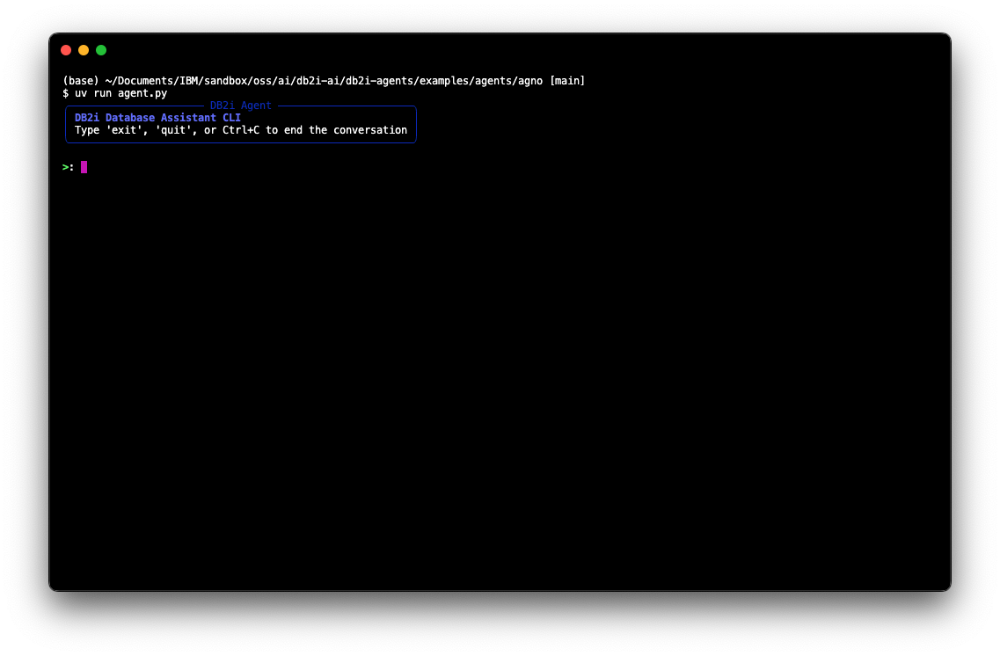
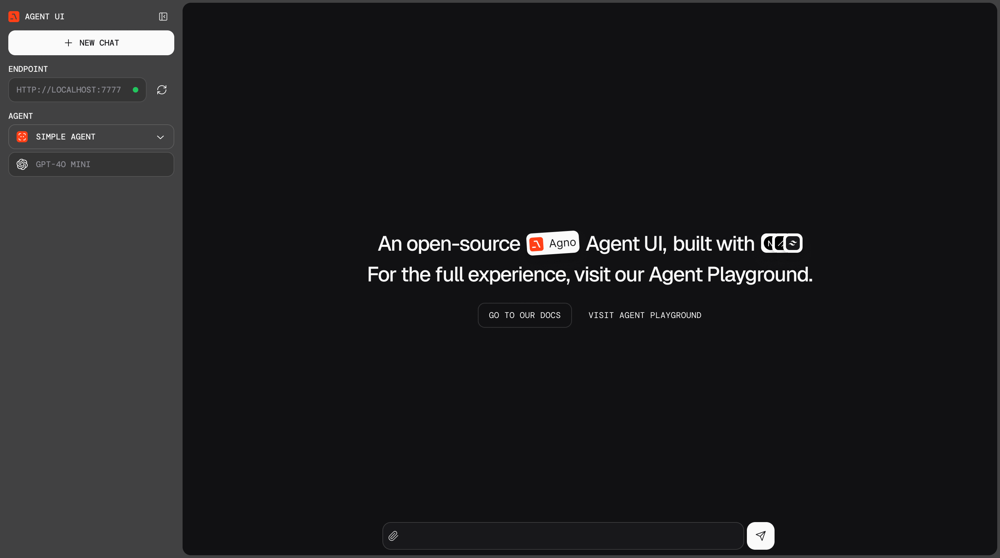
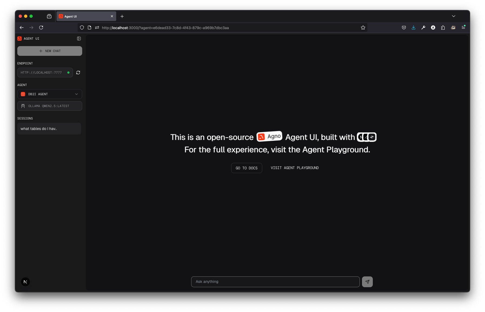

# Agno Db2i Agent

A collection of agents for interacting with Db2i databases using the Agno framework. This package includes a command-line interface and a web-based playground for database exploration and querying.

## 🚨 Before You Start

**Have you completed the main setup?** This framework requires the environment setup from the main README.

✅ **Required**: Complete the [Getting Started guide](../../../README.md#-getting-started) first, which covers:
- Setting up Mapepire on IBM i
- Creating your `.env` file with database credentials  
- Installing uv package manager
- Choosing your AI model provider

If you haven't done this yet, **stop here** and complete the main setup first.

## Prerequisites

- Python 3.12+
- [uv](https://github.com/astral-sh/uv) for package management  
- [Ollama](https://ollama.ai/) (optional, for local LLM support)
- [OpenAI API key](https://platform.openai.com/api-keys) (optional, for OpenAI model support)
- **✅ Completed main repository setup** (see above)

## Run the Db2i Agent CLI

Install the dependencies:

- uv:  
    ```bash
    curl -LsSf https://astral.sh/uv/install.sh | sh
    ```

- Install Ollama from [Ollama](https://ollama.com/)
---

## 🔧 Framework-Specific Setup

Since you've completed the main setup, you can now run Agno agents directly:

1. **Navigate to the Agno directory:**
   ```bash
   cd frameworks/agents/agno
   ```

2. **Verify your setup:**
   ```bash
   # Your root .env file should already contain your database credentials
   # The framework will automatically find and use it
   ```

3. **Pull Ollama model (if using local models):**
   ```bash
   ollama pull qwen2.5:latest
   # OR try the new recommended model for better general performance:
   ollama pull gpt-oss:20b
   ```

   > 💡 **Recommended**: Try `gpt-oss:20b` for a GPT-like experience with excellent general performance!

4. **Run the CLI:**
    ```bash
    usage: uv run agent.py [-h] --provider {ollama,openai,watsonx} [--model-id MODEL_ID] [--debug] [--stream]

    options:
    -h, --help            show this help message and exit
    --provider {ollama,openai,watsonx}
                            Model provider (default: None)
    --model-id MODEL_ID   Use Ollama model (default: qwen2.5:latest)
    --debug               Enable debug mode (default: False)
    --stream              Enable streaming (default: False)
    ```
    Run with `Ollama`:
    ```bash
    uv run agent.py --provider ollama --model-id qwen2.5:latest --debug
    # OR try with the new recommended model:
    uv run agent.py --provider ollama --model-id gpt-oss:20b --debug
    ```



5. **Chat wth the agent**

### Run with Watsonx

To run the agent with Watsonx, make sure your root `.env` file includes watsonx credentials:
```env
IBM_WATSONX_API_KEY=your_watsonx_api_key
IBM_WATSONX_PROJECT_ID=your_project_id
IBM_WATSONX_BASE_URL=https://us-south.ml.cloud.ibm.com
IBM_WATSONX_MODEL_ID=meta-llama/llama-3-3-70b-instruct
```
Then run the agent with the following command:
```bash
uv run agent.py --provider watsonx --debug
```


### Demo
Once the agent is running, you can interact with it through the command line. You can ask questions about the database, and the agent will respond with relevant information.

here are some example queries you can try:
```text
What tables to I have access to?
which employee has the highest salary?
How many employees are in each department?
```

Here is quick demo of the agent in debug mode to show the tool calls and thinking process:


https://github.com/user-attachments/assets/4a865b3a-7f31-452f-9828-fc9536a2f0e9

## Run the Db2i Agent Web Playground

Agno provides a UI for interacting with your agents, completely open source. It’s a simple interface that allows you to chat with your agents, view their memory, knowledge, and more.

### Getting started

To run the Agent UI locally, cd to `agent-ui` and start the ui server:
```bash
cd db2i-agents/frameworks/agents/agno/agent-ui
npm run dev
```

Open http://localhost:3000 to view the Agent UI



### Connect Db2i Agent

The agent UI needs to connect to a playground server, which we can run locally. 

In another terminal, run the db2 playground server:

1. navigate to the `db2i-agents` directory:
   ```bash
   cd db2i-agents/frameworks/agents/agno
   ```
2. run the server:
   ```bash
   uv run db2i_playground.py
   ```
3. (Optional) Use OpenAI:
   ```bash
   export OPENAI_API_KEY=sk-***
   ```
   Run playground with `--use-openai` flag:
   ```bash
    uv run db2i_playground.py --use-openai
    ```

### View the playground

- Open http://localhost:3000 to view the Agent UI
- Select the localhost:7777 endpoint and start chatting with the db2i agent!
  



## Db2i Agent Workspace

Check out this repo to run a [Db2 for i agent application](https://github.com/ajshedivy/agent-app-agno) built with the Agno framework! 


## Mapepire AI Integration (WIP)

Mapepire AI is an AI platform for building tools to interact with your Db2 for i database. It provides an easy way to create SQL based tools that can seamlessly integrate with your LLM applications.

To test Mapepire AI tools:
1. **Configure tools and generate MCP server token** (external setup required)
2. **Add MCP server token to your root `.env` file:**
    ```env
    MAPEPIRE_AI_MCP_URL="http://localhost:8080/sse?token=YOUR_TOKEN"
    ```
3. **Pull Ollama model (if not already done):**
    ```bash
    ollama pull qwen2.5:latest
    # OR try the new recommended model:
    ollama pull gpt-oss:20b
    ```
4. **Run the agent:**
    ```bash
    cd frameworks/agents/agno
    uv run mapepire_ai.py --debug
    ```

### Demo


https://github.com/user-attachments/assets/970ccc8a-67e2-4c50-b3d1-ef13608a880b


